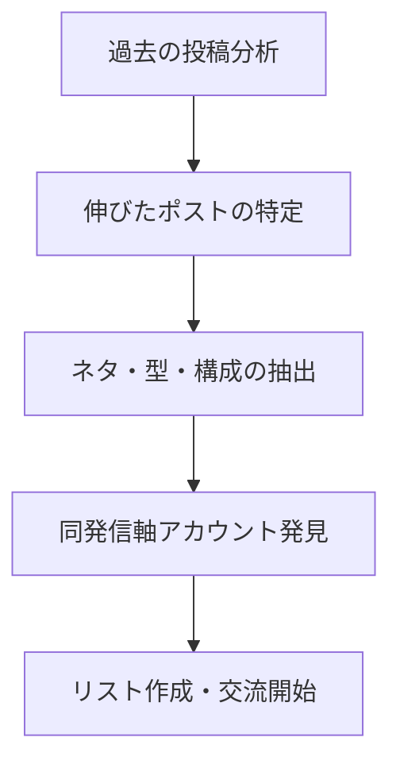
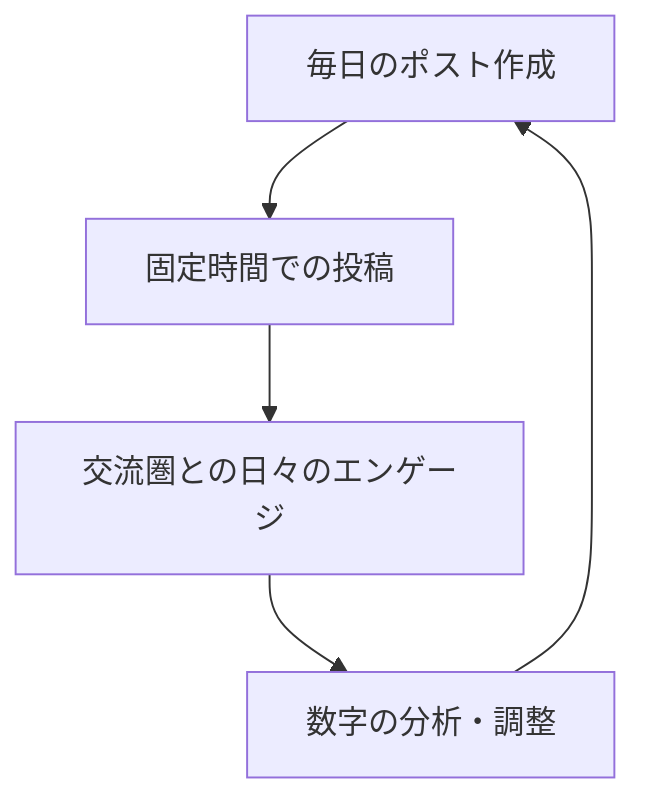
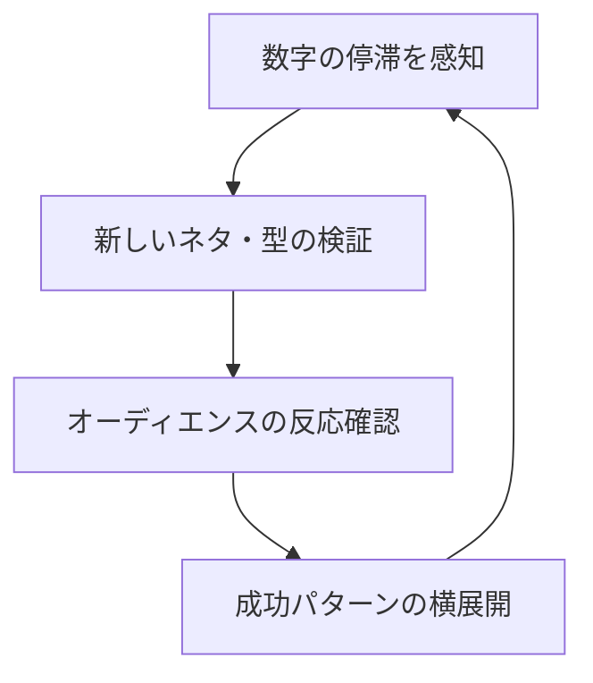

# チーズバーガー戦略 - X運用完全ガイド

## 概要

**チーズバーガー理論**とは、伸びたポストと同じような内容や型を再び投稿することで、安定したインプレッションを獲得し続ける「横展開」戦略です。ロコテック(@loco_technology)氏により体系化された、2,000〜5,000フォロワーまで一気に伸ばすための実証済みテクニックです。

## 🍔 チーズバーガー理論とは

### 基本概念

**「横展開」** = 伸びたポストと同じような内容や型を再びポストする

### 効果例

- 1日目のポストが1万インプ → 2日目のポストも1万インプ → 3日目のポストも1万インプ
- インプレッションの「底」が安定する
- 毎日ポストを伸ばしている人の多くがこの理論を実践

### なぜ効果があるのか

**Xのアルゴリズムの特性**:
- ユーザーがエンゲージメントする可能性があるポストを優先的に表示
- 判断材料に「過去のエンゲージメントデータ」を含む
- 過去のポストにエンゲージした人に対して「類似のポスト」や「続きのポスト」が表示されやすい

## 📊 Xアルゴリズムの特性理解

### 1. アルゴリズムの基本動作

```
Xのアルゴリズム ≒ おすすめタイムラインへの表示を決める仕組み
    ↓
ユーザーにとって興味のあるポストを選択
    ↓
「興味があるかどうか」の判断に過去のエンゲージメントを考慮
    ↓
類似のポスト・続きのポストが表示されやすくなる
```

### 2. 興味の紐づけメカニズム

**例**: ユーザーAの「明日はYOASOBIのライブ！」ポストにエンゲージした場合

- **アカウントへの興味**: ユーザーAの他のポストも表示されやすくなる
- **コンテンツへの興味**: YOASOBIライブ関連の（他ユーザーの）ポストも表示される
- **最優先表示**: 「ユーザーA」の「YOASOBIライブ関連ポスト」

### 3. 新規リーチの仕組み

- YOASOBIに関する他のポストにエンゲージした人のタイムラインにも表示される可能性
- コンテンツテーマを通じた横の広がりが発生

## 🎯 具体的な実践テクニック

### Ⅰ. ネタと型の選定

#### ネタ選び（例：X運用テーマの場合）

**反応が良いネタ**:
- シャドウバン
- 凍結
- アカウントロック
- アルゴリズム
- フォロワーの増やし方

#### 型選び

**情報発信系で相性の良い型**:
- 箇条書き
- 図解＋短文
- 140文字つめつめ
- ストーリー

#### 要素抽出の3つの観点

1. **ネタ**: どんなテーマ・キーワードが伸びているか
2. **メディアの有無と内容**: 画像枚数、図解/イラスト、動画の有無
3. **ポストの構成**: 文字数、改行位置、構造

**例**:
```
1. シャドウバンネタ
2. 画像1枚でポストのスクショ、箇条書きになっている
3. 1行と画像1枚のセット
```

### Ⅱ. 投稿ペースの決定

#### 推奨投稿時間

**4つの時間軸**:
- 6時（朝）
- 13時（昼）
- 18時（夕方）
- 21時（夜）

#### 実践例

- **6時**: チーズバーガー理論のポスト（例：図解＋短文）
- **13時、18時、21時**: 140文字つめつめポスト

#### ポイント

- 最初は4つの時間の中で1つはチーズバーガー理論のポストを配置
- **おすすめは朝か夜の固定時間**
- 最も反応がいい時間で固定する

### Ⅲ. 交流圏の構築

#### 7ステップの交流戦略

1. **同じ発信軸のアカウントを10アカウント発見**
2. **非公開リスト「リストA」に追加**
   - ⚠️ 非公開設定を忘れずに！
3. **リストAメンバーをフォロー＋日1回いいね・リプ**
4. **おすすめに表示される同発信軸ポストにもエンゲージ**
5. **相互エンゲージの高い相手を「リストB」に追加**（目標30名）
6. **日々の交流習慣を継続**
7. **必要に応じてリストを見直し**

#### ⚠️ NGな行動

- フォロバ目的のフォロー
- 誰彼構わずの闇雲ないいね
- いいね返し狙いの行動

**結果**: いいねは多いがインプは伸びない数字になる

### Ⅳ. 必要な所要時間

#### 推奨時間配分

- **1日4ポスト作成**: 1時間半
- **日々の交流**: 1時間半
- **合計**: 約3時間/日

#### フォロワー段階別推奨

- **〜3,000フォロワー**: この運用方法がベスト
- **3,000フォロワー以上**: 時間配分調整可能

### Ⅴ. リフレッシュ戦略

#### 飽きられ対策

- 特定の1ネタ＋1型だけだとオーディエンスが飽きる
- 数字が伸びなくなったらネタ＋型を見直し

#### バリエーション例

**ネタ**:
- シャドウバン → アルゴリズム → フォロワー増加法
- 複数のネタのローテーション

**型**:
- 手描き風アプリの活用
- 手を変え品を変えで対応

## 🎨 ジャンル別成功事例

### イラストアカウント: ぐふとくくさん

**特徴**:
- イラストの内容、サイズを考慮
- 『原付女子風景』などテーマタイトル付きで横展開
- 投稿時間の固定

### 写真アカウント: あーるさん

**特徴**:
- 「日本の風景」をテーマに展開
- 投稿時間の固定

### ビジネスアカウント: おしげさん

**特徴**:
- 箇条書き、140文字つめつめ、図解の型を組み合わせ
- 毎日高い数字を維持
- 投稿時間の固定

## 🛡️ シャドウバン対策15選

### アカウントロックやシャドウバンを避ける方法

1. **短期間で同じ操作を繰り返さない**
2. **他のユーザーを頻繁にメンションしない**
3. **外部リンク貼ったポストの割合を減らす**
4. **ハッシュタグの使用頻度を落とす**
5. **複数のデバイスからログインしない**
6. **同じ内容のポストやリプを何度も投稿しない**
7. **アカウントIDを頻繁に変更しない**
8. **フォロワーを購入しない**
9. **エンゲージメントを購入しない**
10. **エンゲージメントを誘導する投稿を控える**
11. **エンゲージメントベイトのために作られたグループやコミュニティへ参加しない**
12. **他人の著作物を無断で使用しない**
13. **危険なサイトやフィッシングサイトへのリンクを貼らない**
14. **Xの規約等に目を通してルールを守る**
15. **シャドウバン中のユーザーと積極的に交流しない（スパムの可能性があるリプを開かない）**

## 📈 チーズバーガー戦略の実行フロー

### ステップ1: 準備フェーズ



### ステップ2: 実行フェーズ



### ステップ3: 最適化フェーズ



## 🎯 成功KPI

### 短期目標（1-3ヶ月）

- **インプレッション安定率**: 70%以上
- **投稿継続率**: 毎日4ポスト達成
- **交流圏サイズ**: リストA 10名、リストB 30名

### 中期目標（3-6ヶ月）

- **フォロワー増加**: 2,000〜5,000人
- **エンゲージメント率**: 維持または向上
- **ネタ・型のバリエーション**: 3パターン以上確立

### 長期目標（6ヶ月以上）

- **安定したオーディエンス構築**
- **プラットフォーム間の誘導成功**
- **収益化への展開**

## ⚠️ 注意事項とリスク管理

### 避けるべき行動

1. **過度な自動化**: スパム判定のリスク
2. **単調なパターン**: オーディエンスの飽き
3. **競合の完全コピー**: オリジナリティの欠如
4. **交流圏の偏り**: アルゴリズムの混乱

### 推奨する姿勢

- **質と量のバランス**
- **継続的な学習と調整**
- **コミュニティとの健全な関係構築**
- **長期的視点での運用**

## 🔄 継続的改善サイクル

### 週次レビュー

- 各ポストのパフォーマンス分析
- 交流圏の活動状況確認
- 新しいトレンドのキャッチアップ

### 月次調整

- ネタ・型の見直し
- 投稿時間の最適化
- 交流圏の拡張・整理

### 四半期戦略見直し

- 全体戦略の評価
- 新プラットフォーム展開検討
- 収益化戦略の調整

---

**参考**: ロコテック(@loco_technology) X運用初心者向け解説シリーズ Part.6  
**実践推奨**: 声出しなし、顔出しなし、オフライン繋がりなしでも効果的  
**最終更新**: 2025年1月時点の最新アルゴリズム対応 